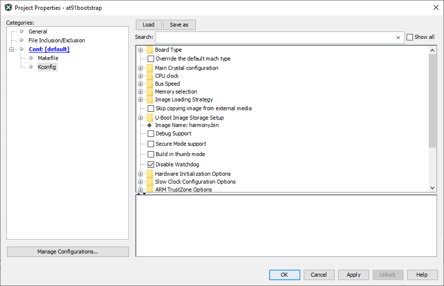
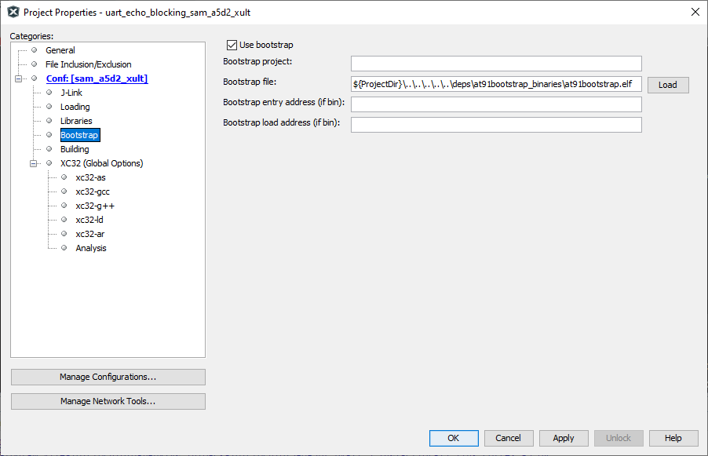

# Using at91boostrap loader with Harmony3 MPU applications

MPU harmony3 applications are compiled and linked to execute from external DRAM memory that is available on the corresponding evaluation kit. This require all peripherals and clock leading to the DRAM memory to be configured prior to the application being programmed into DRAM. This is achieved using a bootstrap loader. We use [AT91bootstrap](https://github.com/linux4sam/at91bootstrap) loader for this purpose.

We have deployed the following pre-built bootstrap binaries inside our application repositories. They can be found under deps folder at the root of the repository.

<<<<<<< HEAD
| Binary Name      | Description                                    |
| ---------------- | ---------------------------------------------- |
| at91bootstrap.elf | Bootstrap which allows debug or run application using MPLABx |
| boot.bin  | Bootstrap which allows booting application using an SD Card |

To use at91boostrap to load and run harmony applications from MPLABx, it should be build with "bkpt_none_defconfig" configuration. If you are intrested in building at91bootstrap using MPLABx, you can read about it [here](readme_bootstrap_build.md).
=======
To facilitate the debugging and running of the MPU application, each application in this repository is bundled with its own copy of the AT91Bootstrap project. Each copy of the bootstrap project can be found under same folder as the application project and is named and is prefixed with "at91bootstrap_". For eg: if the application folder name is sam_a5d29_curiosity.X, then bootstrap project folder will be named at91bootstrap_sam_a5d29_curiosity.X and will be present at the same folder level.

Bootstrap project is configured to load and execute a raw binary file named "harmony.bin" from the SD card. SD card slot to be used shall vary with the evaluation kit.

Each application project is configured with a post build step which will generate the necessary binary file named "harmony.bin" at the end of each build.

If you are only interested in running or debugging the MPU applications in this repository , you can skip the following sections and  and jump straight to [Debugging MPU application using MPLABx](#debugging-mpu-applications-using-mplabx). Each copy of the bootstrap project in this repository is preconfigured to the correct evaluation kit.Also, the bootstrap binary files required to program and run the  applications are checked into the repository.

## Building AT91Bootstrap project

- Bootstrap project can be configured using MPLABx using its KCONFIG menu. To do this, open the project in MPLABx, right click on the project and select  "properties". In categories, select "Kconfig" as shown below:

    

- Click on "LOAD" button and navigate to the boards folder inside the project. Choose the a  default configuration file (defconfig) config file to select a target evaluation board and boot method
  - For eg: If you want to boot harmony.bin file from sd card for SAMA5D29 Curiosity kit, navigate to board/sama5d29_curiosity folder and select "sama5d29_curiositysd_harmony_defconfig" file

- Click on "Apply" and "OK" buttons to configure the project

- Build the project to generate the bootstrap binaries

- *Note: At91bootstrap project requires arm-gcc to build it. XC32 toolchain is not supported yet*

## Configure MPLABx application to use AT91Bootstrap loader

MPLABx debugger relies on AT91Bootstrap to configure the board before programming the application binaries. To configure an application to use AT91Bootstrap, follow the steps detailed below:
>>>>>>> 3af84829 ([Docs] Update board name in readme files)

### Configure a debug tool

- Open the MPLABx applicaton that you want to debug or run in MPLABx.
- Right click on the application project and select properties. This will open the properties window. In the configuration option --> connected hardware tools, select the debugger.

    

    *Note: if no debugger is connected, click on the "show all" check box and select the supported debugger*

- Select the target toolchain and click on apply to save the changes

- This will result in an additional menu option to be available in the configuration tree view called "bootstrap" as shown below:

    

### Configure bootstrap

- Click on "Use bootstrap" check box to enable bootstrap support

- Click on the "LOAD" button to load the bootstrap file. This will open a file picker, which allows you to choose the bootstrap binary file.

- Navigate to the {repository root}/deps/{board name}/at91bootstrap_binaries folder as explained in the previous section. You should choose "at91bootstrap.elf" file (The "Bootstrap entry address" and the "Bootstrap load address" text box can be left empty as this information will be read from the ELF file automatically)

    

## Run/Debug MPU applications using MPLABx

You can now Run/Debug the MPU application just like any other MPLABx applications. When executed, MPLABx performs a two stage loading:

**Stage 1:** Loads the bootstrap loader into the internal SRAM and executes it. This will configure the board specific peripherals and memory

**Stage 2:** Loads the application into the external DRAM and debugs it. User can perform actions like setting breakpoints, single-stepping etc.

When using MPLABx to debug a harmony application, you will face the following limitations:

- Call stack is not fully supported yet, hence stepping in and out of functions may not work correctly.

## Boot to application using SD card

Copy both the application binary named "harmony.bin" and the bootstrap binary named "boot.bin" onto an SD card. Insert the SD card into the SD slot of the evaluation kit and press the reset button.

The ROM bootloader will copy the bootstrap binary "boot.bin" into the internal SRAM and executes it. The bootstrap will configure the external DRAM and the required peripherals, then copy the applicaton binary "harmony.bin" into the DRAM and executes it.
