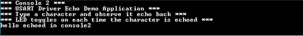

# USART driver asynchronous - USART multi instance

This example echoes the received characters over the two consoles using the USART driver in asynchronous mode.

## Description

This example uses the USART driver in asynchronous mode in both Bare-Metal and RTOS environments to communicate over two consoles. It receives and echoes back the characters entered by the user on the respective console.

## Downloading and building the application

To clone or download this application from Github, go to the [main page of this repository](https://github.com/Microchip-MPLAB-Harmony/core_apps_sam_a5d2) and then click Clone button to clone this repository or download as zip file.
This content can also be downloaded using content manager by following these [instructions](https://github.com/Microchip-MPLAB-Harmony/contentmanager/wiki).

Path of the application within the repository is **apps/driver/usart/async/usart_multi_instance/firmware** .

To build the application, refer to the following table and open the project using its IDE.

| Project Name      | Description                                    |
| ----------------- | ---------------------------------------------- |
| sam_a5d2_xult.X | MPLABX project for [SAMA5D2 Xplained Ultra Evaluation Kit](https://www.microchip.com/DevelopmentTools/ProductDetails/ATSAMA5D2C-XULT) |
| sam_a5d2_xult_freertos.X | MPLABX project for [SAMA5D2 Xplained Ultra Evaluation Kit](https://www.microchip.com/DevelopmentTools/ProductDetails/ATSAMA5D2C-XULT) |
| sam_a5d2_xult_freertos_iar.IAR | IAR project for [SAMA5D2 Xplained Ultra Evaluation Kit](https://www.microchip.com/DevelopmentTools/ProductDetails/ATSAMA5D2C-XULT) |
| sam_a5d2_xult_iar.IAR | IAR project for [SAMA5D2 Xplained Ultra Evaluation Kit](https://www.microchip.com/DevelopmentTools/ProductDetails/ATSAMA5D2C-XULT) |
|||

## Setting up the hardware

The following table shows the target hardware for the application projects.

| Project Name| Board|
|:---------|:---------:|
| sam_a5d2_xult.X   sam_a5d2_xult_freertos.X   sam_a5d2_xult_freertos_iar.IAR   sam_a5d2_xult_iar.IAR | [SAMA5D2 Xplained Ultra Evaluation Kit](https://www.microchip.com/DevelopmentTools/ProductDetails/ATSAMA5D2C-XULT) |
|||

### Setting up [SAMA5D2 Xplained Ultra Evaluation Kit](https://www.microchip.com/DevelopmentTools/ProductDetails/ATSAMA5D2C-XULT)

#### Addtional hardware required

- SD Card with FAT32 file system
- [USB UART CLICK](https://www.mikroe.com/usb-uart-click) board

#### Setting up the SD Card

- Download harmony MPU bootstrap loader from this [location](https://github.com/Microchip-MPLAB-Harmony/at91bootstrap/blob/master/boot.bin)
- Copy the downloaded boot loader binary( boot.bin) onto the SD card

#### Setting up the board

- Connect [USB UART CLICK](https://www.mikroe.com/usb-uart-click) board to the evaluation kit using the pin connections described below:

    | SAM A5D2 Xplained Ultra board Pins | USB UART Click board Pins  |
    | ---------------------------------- | -------------------------- |
    | F0_TXD, J22 connector              | RX                         |
    | F0_RXD, J22 connector              | TX                         |
    | PIN 20, XPRO EXT2 connector        | 3.3V                       |
    | PIN 19, XPRO EXT2 connector        | GND                        |

- SDMMC slot used for bootloading the application is SDMMC1
- Short jumper JP2 (DEBUG_DIS)
- Connect the Debug USB port on the board to the computer using a micro USB cable

## Running the Application

1. Build the application using its IDE
2. Copy the output binary (named 'harmony.bin') onto the SD Card (Refer to the 'Setting up hardware' section above for setting up the SD card)
3. Insert the SD card into SDMMC slot on the board (Refer to the 'Setting up hardware' section for the correct SDMMC slot)
4. Open the Terminal application (Ex.:Tera term) on the computer for both ports
5. Connect to the EDBG/Jlink Virtual COM port and configure the serial settings as follows:
    - Baud : 115200
    - Data : 8 Bits
    - Parity : None
    - Stop : 1 Bit
    - Flow Control : None
6. Reset the board to run the application
7. Type a character and observe the output on the two consoles as shown below:
    - If success the character typed echoes back and an LED toggles on each time the character is echoed
    - **Console 1**

    

    - **Console 2**

    

Refer to the following table for LED name:

| Board | LED Name |
| ----- | -------- |
|  [SAMA5D2 Xplained Ultra Evaluation Kit](https://www.microchip.com/DevelopmentTools/ProductDetails/ATSAMA5D2C-XULT)  | RGB_LED(Green) |
|||
