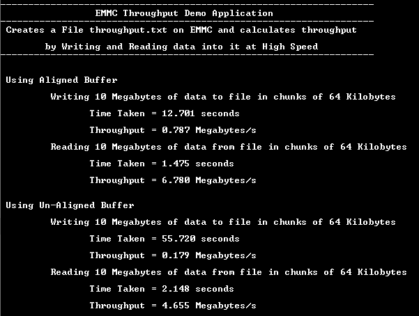

# FAT filesystem throughput using eMMC Media

This application calculates throughput by Writing and Reading data into a eMMC device at High Speed using the MPLAB Harmony File System and the SDMMC driver.

## Description

### Application performs below filesystem operations and throughput calculations on eMMC device using both **Aligned** and **Unaligned** buffers

- Opens a file named **throughput.txt** in the root directory of the eMMC device
- Writes 10 Megabytes of data to file in chunks of 64 Kilobytes
- Once the operation is completed it calculates the time taken and overall throughtput for write in **Megabytes/second** and displays on the console
- Reads 10 Megabytes of data from file in chunks of 64 Kilobytes
- Once the operation is completed it calculates the time taken and overall throughtput for reading in **Megabytes/second** and displays on the console
- Closes the file once read is completed
- Checks if the Above steps need to be repeated for **Unaligned buffer**. If already done then it Glows an LED reporting success and the console will have throughput information for both Aligned and Unaligned buffers.

### File system layer uses:

- SDMMC Driver to communicate to eMMC device

## Downloading and building the application

To clone or download this application from Github, go to the [main page of this repository](https://github.com/Microchip-MPLAB-Harmony/core_apps_sam_a5d2) and then click Clone button to clone this repository or download as zip file.
This content can also be downloaded using content manager by following these [instructions](https://github.com/Microchip-MPLAB-Harmony/contentmanager/wiki).

Path of the application within the repository is **apps/fs/emmc_fat_throughput/firmware** .

To build the application, refer to the following table and open the project using its IDE.

| Project Name      | Description                                    |
| ----------------- | ---------------------------------------------- |
| sam_a5d2_xult.X | MPLABX project for [SAMA5D2 Xplained Ultra Evaluation Kit](https://www.microchip.com/DevelopmentTools/ProductDetails/ATSAMA5D2C-XULT) |
|||

## Setting up AT91Bootstrap loader

To load the application binary onto the target device, we need to use at91bootstrap loader. Refer to the [at91bootstrap loader documentation](../../docs/readme_bootstrap.md) for details on how to configure, build and run bootstrap loader project and use it to bootstrap the application binaries.

## Setting up the hardware

The following table shows the target hardware for the application projects.

| Project Name| Board|
|:---------|:---------:|
| sam_a5d2_xult.X | [SAMA5D2 Xplained Ultra Evaluation Kit](https://www.microchip.com/DevelopmentTools/ProductDetails/ATSAMA5D2C-XULT) |
|||

### Setting up [SAMA5D2 Xplained Ultra Evaluation Kit](https://www.microchip.com/DevelopmentTools/ProductDetails/ATSAMA5D2C-XULT)

#### Addtional hardware required

- SD Card with FAT32 file system

#### Setting up the SD Card

- Download harmony MPU bootstrap loader from this [location](firmware/at91bootstrap_sam_a5d2_xult.X/binaries/boot.bin)
- Copy the downloaded boot loader binary( boot.bin) onto the SD card

#### Setting up the board

- SDMMC slot used for bootloading the application is SDMMC1
- Short jumper JP2 (DEBUG_DIS)
- Connect the Debug USB port on the board to the computer using a micro USB cable
- Jumper JP9 (BOOT_DIS) should be open

**NOTE: To run this demo successfully, on board eMMC device should have a valid FAT partition**

## Running the Application

1. Build the application using its IDE
2. Copy the output binary (named 'harmony.bin') onto the SD Card (Refer to the 'Setting up hardware' section above for setting up the SD card)
3. Insert the SD card into SDMMC slot on the board (Refer to the 'Setting up hardware' section for the correct SDMMC slot)

4. Open the Terminal application (Ex.:Tera term) on the computer.
5. Connect to the EDBG/Jlink Virtual COM port and configure the serial settings as follows:
    - Baud : 115200
    - Data : 8 Bits
    - Parity : None
    - Stop : 1 Bit
    - Flow Control : None

6. Reset the board to run the application
7. The LED is turned ON if there was no error during the file operations

    Refer to the following table for LED name:

    | Board | LED Name |
    | ----- | -------- |
    |  [SAMA5D2 Xplained Ultra Evaluation Kit](https://www.microchip.com/DevelopmentTools/ProductDetails/ATSAMA5D2C-XULT)  | RGB_LED(Green) |
    |||

7. Calculated throughput values for Aligned and Un-Aligned buffers are dispalyed on console as below:
    - **Note:** The Values showed in the below output may differ slightly when demo is run

   

## Additional Steps (Optional)

### To increase the throughput for the Un-aligned buffers you can follow below steps

- Launch MHC for the project

- Increase the size for the internal aligned buffer used by Filesystem service with some value as shown below. This internal buffer will be used when application buffer is Un-aligned and placed in cacheable region.
    - **Note:** Increasing the size of the aligned buffer will consume more RAM

    

- Regenerate the project

- Once done repeat the steps mentioned in [Running The Application](#running-the-application) and observe the change in throughput for Un-aligned buffer
