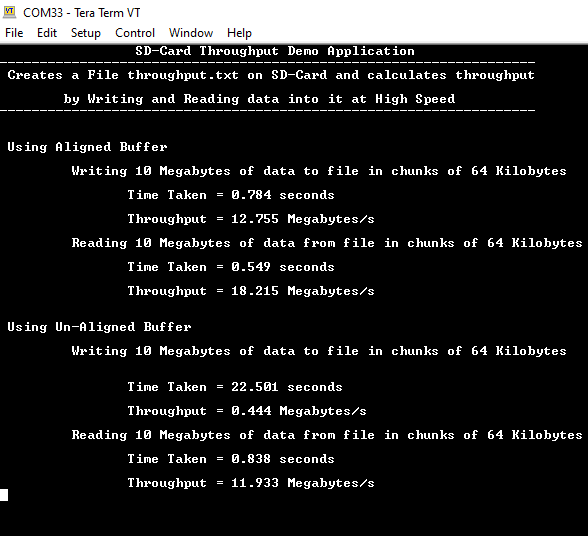
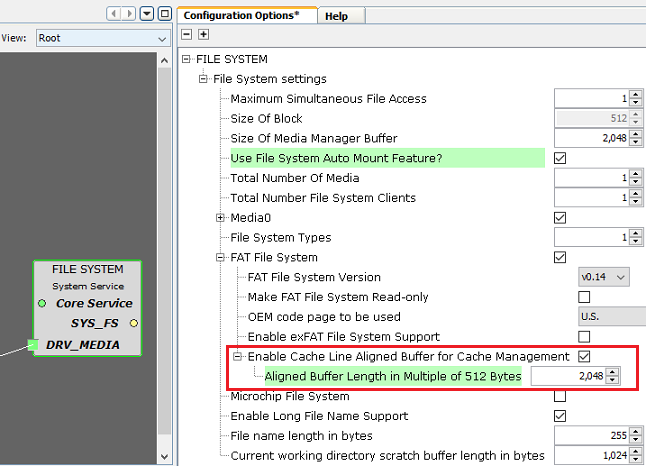

# FAT Filesystem throughput using SDMMC Media

This application calculates throughput by Writing and Reading data into a SD-Card at High  Speed using the MPLAB Harmony File System and the SDMMC driver.

**Parent topic:**[Harmony 3 Driver and System Service Application Examples for SAMA5D2 Family](GUID-89743DCD-F235-4D2D-AE19-B9D1B98911AD.md)

## Description

### Application performs below filesystem operations and throughput calculations on SD-Card using both Aligned and Unaligned buffers

-   Opens a file named **throughput.txt** in the root directory of the SD card.
-   Writes 10 Megabytes of data to file in chunks of 64 Kilobytes.
-   Once the operation is completed it calculates the time taken and overall throughput for write in **Megabytes/second** and displays on the console.
-   Reads 10 Megabytes of data from file in chunks of 64 Kilobytes.
-   Once the operation is completed it calculates the time taken and overall throughput for reading in **Megabytes/second** and displays on the console.
-   Closes the file once read is completed.
-   Checks if the Above steps need to be repeated for **Unaligned buffer**. If already done then it Glows an LED reporting success and the console will have throughput information for both Aligned and Unaligned buffers.

### File system layer uses:

-   SDMMC Driver to communicate to SD Card

## Downloading and Building the Application

To clone or download this application from Github, go to the [main page of this repository](https://github.com/Microchip-MPLAB-Harmony/core_apps_sam_a5d2) and then  click Clone button to clone this repository or download as zip file. This content  can also be downloaded using content manager by following these [instructions](https://github.com/Microchip-MPLAB-Harmony/contentmanager/wiki).

Path of the application within the repository is  **apps/fs/sdmmc\_fat\_throughput/firmware**.

To build the application, refer to the following table and open the project using its  IDE.

|Project Name|Description|
|------------|-----------|
|sam\_a5d2\_curiosity.X|MPLABX project for [SAMA5D29 Curiosity Development Board](https://www.microchip.com/en-us/development-tool/EV07R15A)|

## Setting Up AT91Bootstrap loader

To load the application binary onto the target device, we need to use at91bootstrap  loader. Refer to the [at91bootstrap loader documentation](GUID-EC647FFE-720B-413C-81C5-6ACA67E7CC7B.md) for details on how to  configure, build and run bootstrap loader project and use it to bootstrap the  application binaries.

## Setting Up the Hardware

The following table shows the target hardware for the application projects.

|Project Name|Description|
|------------|-----------|
|sam\_a5d2\_curiosity.X|[SAMA5D29 Curiosity Development Board](https://www.microchip.com/en-us/development-tool/EV07R15A)|

### Setting Up SAMA5D29 Curiosity Development Board

**ADDTIONAL HARDWARE REQUIRED**

-   SD Card with FAT32 file system
    -   The SD Card should have at least 10MB of free space for the demo to work

**SETTING UP THE BOARD**

-   Insert the SD card into Micro-SD Card slot \(J6\) provided under the board.
-   Connect the Debug USB port on the board to the computer using a USB-C type cable
-   Connect UART Debug port on board to the computer using FTDI-USB cable.

## Running the Application

1.  Build the application using its IDE.
2.  Open the Terminal application \(Ex.:Tera term\) on the computer.
3.  Connect to the Virtual COM port and configure the serial settings as follows:
    -   Baud : 115200
    -   Data : 8 Bits
    -   Parity : None
    -   Stop : 1 Bit
    -   Flow Control : None
4.  The LED is turned ON if there was no error during the file operations.

    Refer  to the following table for LED name:

    |Board|LED Name|
    |-----|--------|
    |[SAMA5D29 Curiosity Development Board](https://www.microchip.com/en-us/development-tool/EV07R15A)|RGB\_LED \(Green\)|

5.  Calculated throughput values for Aligned and Un-aligned buffers are displayed on console as below:

    **Note:** The Values showed in the below output may differ slightly when demo is run.

    

## Additional Steps \(Optional\)

### To increase the throughput for the Un-aligned buffers you can follow below steps

-   Launch MHC for the project.
-   Increase the size for the internal aligned buffer used by Filesystem service with some value as shown below. This internal buffer will be used when application buffer is Un-aligned and placed in cacheable region.
-   **Note:** Increasing the size of the aligned buffer will consume more RAM.

    

-   Regenerate the project.
-   Once done repeat the steps mentioned in [Running the Application](#CONCEPT_LZF_HRZ_XYB) and observe the change in throughput for Un-aligned buffer.

